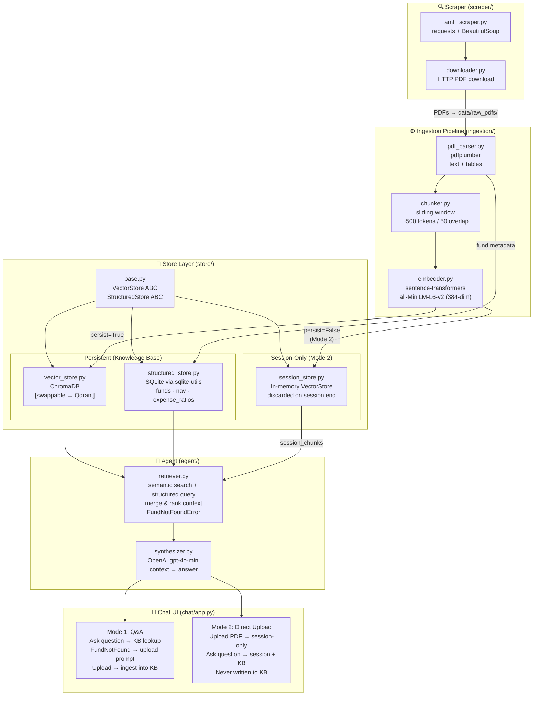

# Mutual Fund Factsheet RAG Agent — Architecture

## Component Diagram



## ASCII Overview

```
┌──────────────────────────────────────────────────────────────────────────┐
│               MUTUAL FUND FACTSHEET RAG AGENT                            │
└──────────────────────────────────────────────────────────────────────────┘

  ┌──────────────────────────────────────────────────┐
  │               SCRAPER (scraper/)                  │
  │  amfi_scraper.py + downloader.py                 │
  │  requests + BeautifulSoup                        │
  │  → PDFs land in data/raw_pdfs/                   │
  └──────────────────────┬───────────────────────────┘
                         │
                         ▼
  ┌──────────────────────────────────────────────────┐
  │       INGESTION PIPELINE (ingestion/)             │
  │  PDF Parser → Chunker → Embedder → Write stores  │
  │  pdfplumber   500-tok   sentence-transformers    │
  │                                                  │
  │  ingest_pdf(path, persist=True)  → KB            │
  │  ingest_pdf(path, persist=False) → session only  │
  └──────────────────────┬───────────────────────────┘
           ┌─────────────┴──────────────┐
           ▼                            ▼
  ┌────────────────────┐    ┌──────────────────────────────┐
  │  STRUCTURED STORE  │    │   VECTOR STORE               │
  │  SQLite            │    │   ChromaDB (persistent KB)   │
  │  (sqlite-utils)    │    │   [abstracted → swap Qdrant] │
  │  funds / nav /     │    │                              │
  │  expense_ratios    │    │   session_store.py           │
  └─────────┬──────────┘    │   (in-memory, Mode 2 only)  │
            │               └──────────────┬───────────────┘
            │                              │
            └──────────────┬───────────────┘
                           │
  ┌────────────────────────▼─────────────────────────┐
  │              AGENT (agent/)                       │
  │                                                  │
  │  retriever.py                                    │
  │  • searches persistent store (ChromaDB + SQLite) │
  │  • merges session chunks if provided (Mode 2)    │
  │  • raises FundNotFoundError if fund absent        │
  │    (Mode 1 only, when no session PDF either)     │
  │                                                  │
  │  synthesizer.py → OpenAI gpt-4o-mini             │
  └──────────────────────┬───────────────────────────┘
                         │
                         ▼
  ┌──────────────────────────────────────────────────┐
  │           CHAT UI (chat/app.py)  — Streamlit      │
  │                                                  │
  │  ┌─────────────────────────────────────────────┐ │
  │  │  MODE 1: Q&A (knowledge-base driven)        │ │
  │  │  User types question                        │ │
  │  │  → Agent retrieves from KB                  │ │
  │  │  → FundNotFound? Show upload prompt         │ │
  │  │    → Upload PDF → ingest into KB → re-query │ │
  │  └─────────────────────────────────────────────┘ │
  │                                                  │
  │  ┌─────────────────────────────────────────────┐ │
  │  │  MODE 2: Direct Upload (session-only)       │ │
  │  │  User uploads PDF → parsed in-memory        │ │
  │  │  User asks questions                        │ │
  │  │  → Agent uses session chunks + KB           │ │
  │  │  → PDF never written to KB                  │ │
  │  │  → Chunks discarded on session end          │ │
  │  └─────────────────────────────────────────────┘ │
  └──────────────────────────────────────────────────┘
```

## Data Flow Summary

| Step | Component | Input | Output | Library |
|------|-----------|-------|--------|---------|
| 1 | Scraper | AMFI website | PDFs in `data/raw_pdfs/` | requests, BeautifulSoup |
| 2 | PDF Parser | PDF file | Text chunks + metadata | pdfplumber |
| 3 | Chunker | Raw text | ~500-token chunks | custom |
| 4 | Embedder | Text chunks | 384-dim vectors | sentence-transformers |
| 5 | Vector Store | Embeddings | ChromaDB collection | chromadb |
| 6 | Structured Store | Fund metadata | SQLite tables | sqlite-utils |
| 7 | Retriever | User question | Ranked context chunks | sentence-transformers + chromadb |
| 8 | Synthesizer | Context + question | Natural-language answer | openai (gpt-4o-mini) |
| 9 | Chat UI | Answer / FundNotFound | Rendered chat message | streamlit |

## Store Abstraction (Pluggability)

`store/base.py` defines abstract interfaces. To swap ChromaDB for Qdrant:
1. Implement `QdrantVectorStore(VectorStore)` in `store/qdrant_store.py`
2. Change the import in `ingestion/pipeline.py` and `agent/retriever.py`
3. Nothing else changes

## Environment Variables

| Variable | Required | Purpose |
|----------|----------|---------|
| `OPENAI_API_KEY` | Yes | OpenAI synthesis (gpt-4o-mini) |
